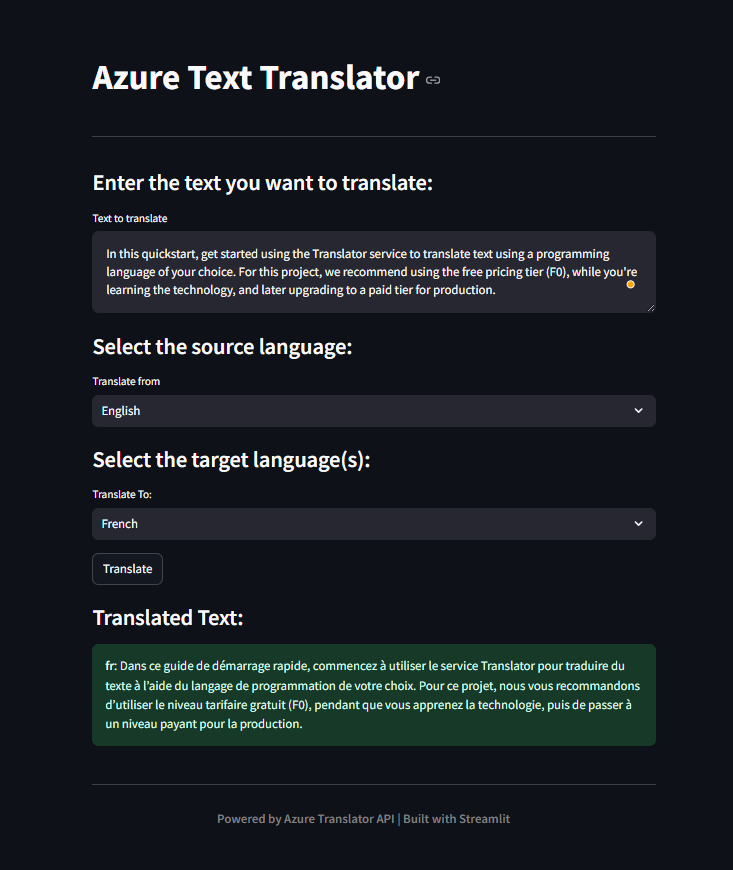

# Text-Translation-using-Azure

### [The application link is here](https://mytranslator.azurewebsites.net/)

# steps to accomplish this project 

1. install the requirements.txt 
2. add the translator.py script
3. Containerize the Application
4. Create the Docker Compose File
5. Build the Docker Image
6. Set Up Azure Resources in azure create th **container registries** and the **app service plans**
7. Connect Docker to Azure Container Registry connect to the registries **DOCKER:REGISTRIES**
8. Push the Docker Image to Azure, go to docker extension then click on the image just created and click on Push then choose the Azure parameters...
9. Deploy the Docker Image to Azure App Service, go to **DOCKER:REGISTRIES** and click on the latest image then deploy this image using azure app service